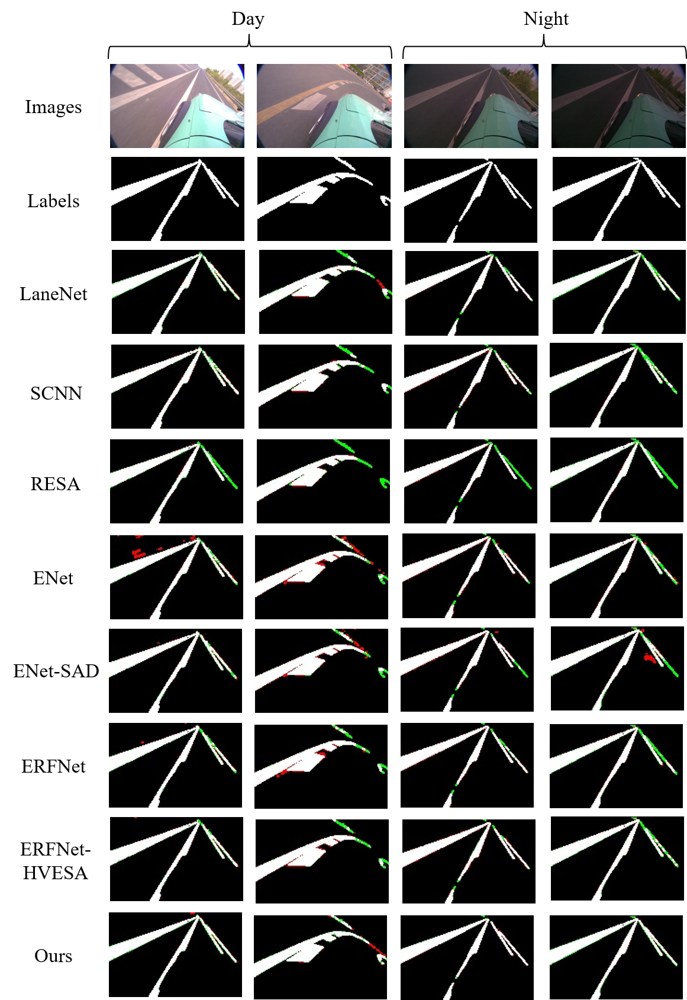

# TCLaneNet Pytorch
 Pytorch implementation of "[TCLaneNet: Task-conditioned Lane Detection Network Driven by Vibration Information](https://ieeexplore.ieee.org/document/10411125)"


## 一、Demo
#### 1. Video


Demo trained with [VBLane Dataset](http://www.openmpd.com/column/Vision-vibration_fusion).


#### 2. Comparison


The visualization results compared with other methods, where red and green represent false positive and false negative respectively.


## 二、Train and test
### 1. Requirements
* pytorch
* opencv
* numpy

### 2. Datasets

* [VBLane Dataset](http://www.openmpd.com/column/Vision-vibration_fusion)
  <details><summary>VBLane dataset path (click to expand)</summary>
  
  ```
  VBLane_path
  ├─ no
    ├─ ano_heng_1-2021-04-12-18-45-23
    ├─ ano_heng_2-2021-04-12-18-47-00
    ├─ ano_heng_3-2021-04-12-18-48-28
    ├─ ano_road_1-2021-04-12-18-37-12
    ├─ ano_road_2-2021-04-12-18-39-02
    ├─ ano_road_3-2021-04-12-18-40-09
  ├─ yes
    ├─ new2_road_again_2-2021-04-12-17-52-27
    ├─ new2_road_again_3-2021-04-12-17-53-30
    ├─ new2_road_again_4-2021-04-12-17-54-56
    ├─ new2_road_again_5-2021-04-12-17-56-39
    ├─ new2_road_again_6-2021-04-12-17-58-01
  └─ list
    ├─ train.txt
    ├─ test.txt
  ```
</details>


You need to change the correct dataset path in `./config.py`
```python
Dataset_Path = dict(
    CULane = "/workspace/CULANE_DATASET",
    Tusimple = "/workspace/TUSIMPLE_DATASET",
    bdd100k = "/workspace/BDD100K_DATASET",
    mydata = "/home/neu-wang/gongyan/big_data/vibration"
)
```

### 3. Training
First, change some hyperparameters in `./experiments/*/cfg.json`
```
{
  "model": "TCLaneNet", 
  # Optional: "SCNN", "LaneNet", "Enet", "Enet-SAD", "Resa", or "TCLaneNet"

  "dataset": {
    "dataset_name": "mydata", 
    "batch_size": 12,
    "resize_shape": [800, 288]       
    #[800, 288] with CULane and VBLane, [640, 368] with Tusimple, and [640, 360] with BDD100K
  },
  ...
}
```

And then, start training with `train.py`.
```
python train.py --exp_dir ./experiments/TCLaneNet
```
If the training is interrupted, the following command is used to resume.
```
python train.py --exp_dir ./experiments/lanenet --resume
```

### 4. Testing
First, change some hyperparameters in `./experiments/*/cfg.json`, e.g., model_path, test. 

```
"evaluate": {
    "test": "yes",
    "model_path": "./experiments/TCLaneNet/TCLaneNet_iou_best.pth"
  }
```
Then, start testing with `test.py`. 
```
python test.py --exp_dir ./experiments/TCLaneNet
```

What's more, if the `test` is yes, you can `python train.py --exp_dir ./experiments/TCLaneNet`.


## 三、Performance

* VBLane dataset

| Method | Rec | Pre | F1 | ACC   | IoU  |  
|  ----  | ----  | ----  | ----  | ----   | ----  | 
| LaneNet | 97.67 | 95.28  | 96.46 | 99.41  | 93.18 |
| SCNN | 93.34 | 97.32  | 95.28 | 99.21   | 91.02 |
| RESA | 96.81 | 95.56  | 96.17 | 99.38  | 92.65 |
| ENet | 92.53 | 97.85  | 95.11 | 99.18  | 90.69 |
| ENet-SAD | 94.62 |96.65  | 95.62 | 99.27  | 91.62 |
| ERFNet | 97.64 |92.86  | 95.25 | 99.20  | 91.21 |
| ERFNet-HVESA | 96.65 | 94.78 | 95.64 | 99.31  | 91.82 |
| TCLaneNet (ours) | 98.53 | 95.64 | 97.06 | 99.51  | 94.29 |

Compared with other methods, our method has better performance in F1, IoU and ACC.

## Acknowledgement
This repo is built based on [ENet-SAD](https://github.com/cardwing/Codes-for-Lane-Detection), [ENet-SAD-Pytorch](https://github.com/InhwanBae/ENet-SAD_Pytorch), [PyTorch-ENet](https://github.com/davidtvs/PyTorch-ENet), and [SCNN_Pytorch](https://github.com/harryhan618/SCNN_Pytorch).
# TCLaneNet
